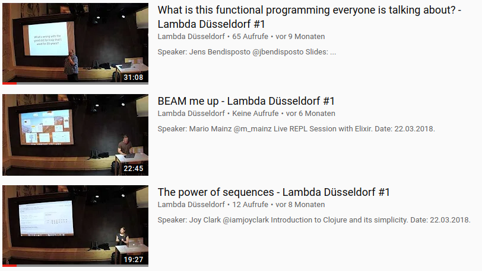

# xml-convert

Diese Bibliothek soll einen RSS Feed als XML einlesen und eine HTML-Datei
erzeugen, welche die Thumbnails inklusive Links zu den Videos generieren kann.
Ziel ist es, dass dieser generierte HTML-Code dann die Videos der rheinJUG per
Jekyll einbinden kann.

Die Videos der rheinJUG werden in der [Mediathek der Heinrich-Heine-Universität
Düsseldorf](https://mediathek.hhu.de/user/RheinJUG) veröffentlicht. Die Website
der rheinJUG wird teilweise automatisch generiert. Dabei werden die nächsten und
vergangenen Meetups über die Meetup-API angefragt und Jekyll-Pages werden
generiert. Wir würden nun gerne noch eine Übersicht der letzten Videos in der
Seite integrieren. Denkbar ist es einen einfachen Feed à la YouTube zu
generieren. Hier ein Beispielbild unserer Videos von [Lambda
Düsseldorf](https://www.youtube.com/channel/UCgw0xUNdc8PMhdux8CEN0Ww):

Das soll nun mit diesem Tool erreicht werden. 

## Usage

Kompilieren `lein uberjar`

Ausführen `java -jar target/xm-convert.jar <url> <output>` 

Default für `url` ist _https://mediathek.hhu.de/rss/7/feed/_, für `output`  _entries.html_.

## License

Copyright © 2019 clojure-dus

This program and the accompanying materials are made available under the
terms of the Eclipse Public License 2.0 which is available at
http://www.eclipse.org/legal/epl-2.0.

This Source Code may also be made available under the following Secondary
Licenses when the conditions for such availability set forth in the Eclipse
Public License, v. 2.0 are satisfied: GNU General Public License as published by
the Free Software Foundation, either version 2 of the License, or (at your
option) any later version, with the GNU Classpath Exception which is available
at https://www.gnu.org/software/classpath/license.html.
